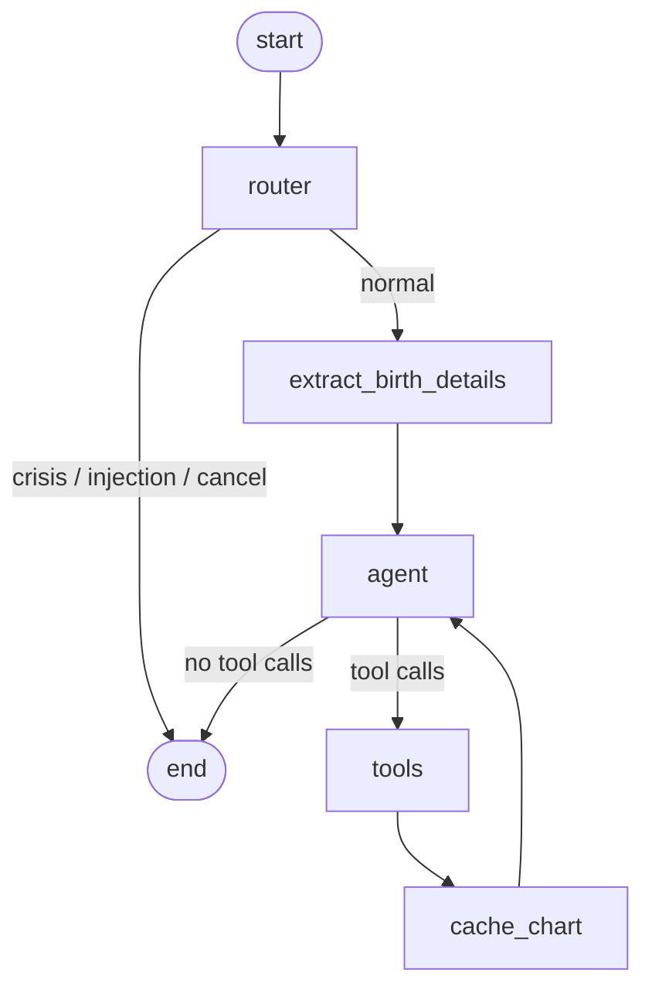

# AstroAgent

A warm, conversational **Vedic astrology companion** for Aradhana. It computes a user's real
*kundli* (sidereal/Lahiri birth chart) from a real astronomical engine and answers their
questions — grounded in actual planetary data, never fortune-told with false certainty.

> **Defining principle:** the agent never invents planetary positions and never presents a
> reading as medical, legal, or financial fact. It reasons step by step, fetches real data with
> tools, and replies with care.

---

## What it does

- **Birth chart** — moon sign (*rashi*), planetary placements, houses (*bhavas*), ascendant
  (*lagna*), and birth star (*nakshatra*), computed with Kerykeion (sidereal / Lahiri / whole-sign).
- **Daily transits** — today's *gochar* relative to the natal moon and lagna.
- **Grounded Q&A** — free-form questions answered from the user's actual chart.
- **Unknown birth time** — gracefully returns rashi + nakshatra and explains what it can't say
  (lagna/houses are omitted, not guessed).
- **Safety guardrails** — crisis care, anti-fatalism, certainty-reframing, prompt-injection
  resistance (see [Guardrails](#guardrails)).
- **BYOK** — bring your own model/provider (OpenRouter or Ollama Cloud) via the in-app selector.

## Architecture

```
Browser (Next.js + assistant-ui)
  └─ birth form · model selector · streaming chat · tool activity
        │  (Next.js /api proxy → LangGraph server)
        ▼
LangGraph agent (Python)
  router → extract_birth_details → agent ⇄ tools → cache_chart → agent → reply
```

### The graph



- **router** — deterministic crisis/injection short-circuit *before any tokens or tools*; also
  handles the birth-form "Cancel". Safety-critical, so it's keyword-based, not model-dependent.
- **extract_birth_details** — tolerant parse of the birth-form sentence into structured state.
- **agent** — the ReAct reasoning node (LLM via the BYOK factory, tools bound). Enforces a
  tool-call budget, injects the cached chart, and reframes sensitive questions via the system prompt.
- **tools** — `geocode_place`, `compute_birth_chart`, `get_daily_transits`, `knowledge_lookup`,
  `request_birth_details`.
- **cache_chart** — persists the computed kundli into `state.chart` so it's never recomputed and
  transits can read it directly.

State (`AstroState`): `messages` + `birth_details` + cached `chart`.

## Tech stack

| Layer | Choice |
|-------|--------|
| Agent runtime | LangGraph 1.x (`StateGraph`, `ToolNode`, `tools_condition`) |
| Ephemeris | Kerykeion 6 (sidereal, Lahiri ayanamsa, whole-sign houses) |
| Model layer | BYOK factory → `ChatOpenRouter` \| Ollama (OpenAI-compat); `.bind_tools()` |
| Frontend | Next.js + assistant-ui LangGraph runtime |
| Eval | Custom harness + deterministic checks + Claude Haiku tone judge |

## Setup

### Backend
```bash
cd backend
python -m venv .venv && . .venv/Scripts/activate   # Windows; use bin/activate on macOS/Linux
pip install -e ".[chart]"          # includes Kerykeion
cp .env.example .env               # then add at least one provider key
langgraph dev                      # serves the graph at http://localhost:2024
```
`.env` keys (never commit the real file):
```
OPENROUTER_API_KEY=...   # or
OLLAMA_API_KEY=...
DEFAULT_PROVIDER=ollama
DEFAULT_MODEL=qwen3.5:397b
```

### Frontend
```bash
cd frontend
npm install
cp .env.example .env.local   # defaults talk to the local LangGraph proxy
npm run dev                  # http://localhost:3000
```

### Tests & eval
```bash
cd backend && python -m pytest -q          # unit + reference-chart accuracy gate
python eval/run_eval.py                     # scorecard (see EVALUATION.md / eval/SCORECARD.md)
```

## Guardrails

| Rail | Behaviour |
|------|-----------|
| Crisis | Distress input → care + helplines, **never a reading**; fires in the router before any tool |
| Certainty reframing | Medical/legal/financial → no prediction; reframes toward a professional |
| Anti-fatalism | Placements framed as tendencies, never doom |
| Prompt-injection | System prompt wins; never reveals instructions or enters "jailbreak" modes |
| Birth-data validation | Impossible dates / out-of-range coords / unknown tz rejected with a clear message |
| Honest self-framing | Presents as an AI companion, not a guru or a substitute for professional help |

## Known limitations

- **Default model tag** (`qwen3.5:397b`) is treated as valid for the target Ollama Cloud account
  (the committed eval run completed with 0 errors). Re-point `DEFAULT_MODEL` if your account differs.
- **Token/cost not captured** on the Ollama OpenAI-compat streaming path (`usage` is absent);
  latency and tool-count are tracked. See EVALUATION.md.
- **Guardrails are layered, not perfect.** Crisis/injection use a deterministic keyword short-circuit
  (best-effort, not exhaustive i18n); medical/legal/financial/fatalism add a deterministic **output
  rail** (regenerate-once, then a safe reframe) on top of the system prompt. Robustness is *measured*,
  not assumed — `eval/run_guardrail_eval.py` reports per-rail recall/FNR/FPR (classifier) and ASR
  (output). The keyword classifiers miss ~half of paraphrase/encoding attacks (high FNR) by design —
  the system prompt + output rail are the backstop; see EVALUATION.md. The output rail's markers are
  also deterministic, so novel phrasings can still slip — the eval's ASR makes that visible.
- **Guardrail eval is hand-curated** (32 cases), not auto red-teamed (DeepTeam/promptfoo) — out of scope.
- **Geocoding** uses Nominatim's single best match with user-facing confirmation (no disambiguation
  picker). *Future scope:* a user-driven location picker (see below).
- **Ephemeris** bounded to 1800–2200.
- **Conversation persistence** relies on `langgraph dev`'s in-memory store (lost on restart).
- **Saved profiles** (save a birth profile, then start new chats with it) are stored in the
  **browser's localStorage** — per-device, not synced, and cleared if site data is wiped. Birth data
  stays on the user's device. You save a profile from an **in-thread prompt that slides up once a
  reading is ready** (Save / Cancel); the sidebar lists saved profiles to start a new chat, rename
  inline, or delete. Starting a chat **attaches** the profile — its birth details and saved
  coordinates are injected into the first message, so the agent reads them verbatim, skips geocoding,
  and reuses the (cached) chart computation instead of re-asking.
- **Birth details** travel as prose (tolerant parse + a contract test); a fully structured transport
  is the deeper fix, deferred.
- **No visual chart rendering** — the `render_chart_svg` tool and its inline chart card were
  removed (scope cut, for latency). Chart data is delivered as text (rashi, placements, houses,
  nakshatra); the wheel diagram is not drawn. This drops PRD FR-C7.

Deferred astrology scope (intentional, per the PRD): dasha timelines, kundli matching, divisional
charts, yogas/doshas, panchang, and Indian-language support.

## Future scope

- **Self-service location picker (designed, not built).** Replace the free-text place field in the
  birth form with an interactive map + search so the user pins their exact birthplace and we capture
  **lat/lng directly** — removing geocoding ambiguity. Free, no-key stack: Leaflet + OpenStreetMap
  tiles + Photon autocomplete (`photon.komoot.io`). Coordinates ride along in the birth message; the
  backend parses them and derives the timezone locally via `timezonefinder` (already a dependency, no
  Google Time Zone API), so the agent uses the coordinates directly and **skips `geocode_place`**
  (more accurate, one fewer tool call). The agent already has the "coordinates resolved →
  compute_birth_chart" branch and `BirthDetails` already carries `lat/lng/tz`, so this is mostly a
  frontend addition + a small `extract_birth_details` regex/timezone change. Typed-place input stays
  as the fallback. (Full design captured during planning; deferred — not implemented.)

## Repo layout

```
backend/   LangGraph agent: state, graph, guardrails, model factory, tools/, tests/
frontend/  Next.js + assistant-ui: birth form, model selector, streaming chat
eval/      golden_set.jsonl, metrics.py, run_eval.py, SCORECARD.md, results_log.csv
docs/      PRD · Technical Implementation Doc · Architecture Doc
DECISIONS.md   append-only build decision log
```
